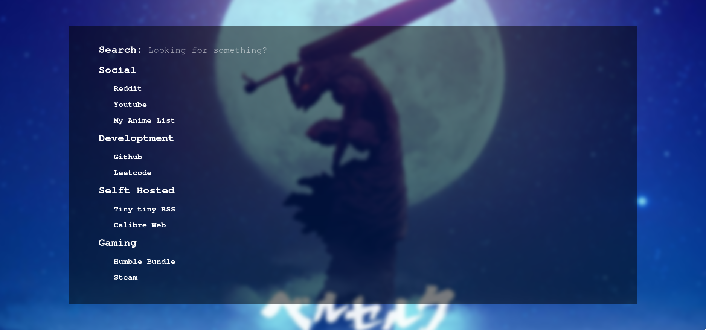

# startPage

A start page made to be the first thing you see when opening your browser or a new tab.

## How it looks like (work in progress)



## Installation process

Copy this repository and cd into it with

```
git clone https://github.com/davidlunadeleon/startPage.git
cd startPage
```

Install the build tools with

```
npm install
```

## Run in dev mode

To run the extension in a Firefox test environment use

```
npm run dev:run
```

After you're done, remember to use the following command to stop the webpack watch

```
pkill -f webpack
```

## To do

- [ ] Show the time
- [X] Show a tree of saved links
- [X] Divide saved links into categories
- [ ] Collapsible categories of links
- [X] Add search bar function
- [ ] Read config from json file
- [ ] Add functionality to change settings within browser
- [ ] Persistent changes to settings
- [ ] Allow file upload to set background image
- [ ] Add wiki
- [ ] Add build scripts
- [ ] Add instructions to actually use in the browser

## Libraries and packages used

This projects is made using Node.js and the following packages:

- [Webpack](https://www.npmjs.com/package/webpack)
- [Web-ext](https://www.npmjs.com/package/web-ext)

## License

This project licensed under the MIT License. For more information see this [file](LICENSE) or read [here](https://opensource.org/licenses/MIT).