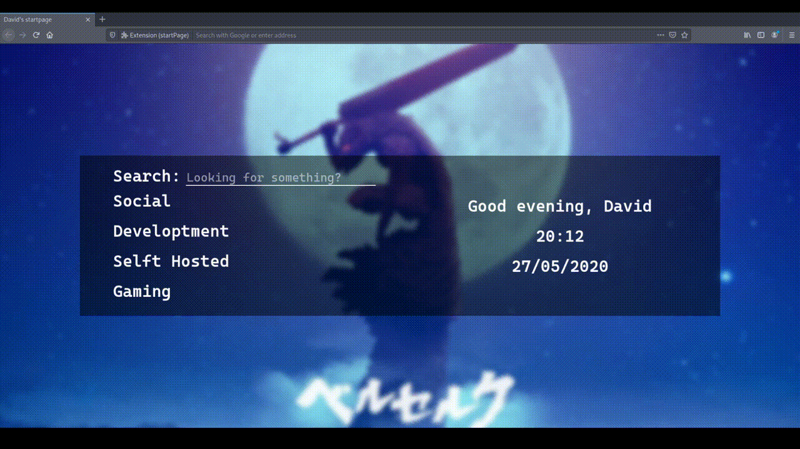

# startPage

A start page made to be the first thing you see when opening your browser or a new tab.

## How it looks like (work in progress)



## Installation process

Copy this repository and cd into it with

```
git clone https://github.com/davidlunadeleon/startPage.git
cd startPage
```

Install the build tools with

```
npm install
```

## Run in dev mode

To run the extension in a Firefox test environment use

```
npm run dev:run
```

After you're done, remember to use the following command to stop the webpack watch

```
pkill -f webpack
```

## Build

To build the extension use

```
npm run build
```

The resulting zip named startpage.zip will be saved to dist/build/

## Sign and use in Firefox

* Guide made with help from [deepjyoti30/startpage](https://github.com/deepjyoti30/startpage/wiki/How-to-sign-the-extension-for-Personal-Use-on-Firefox) wiki

1. Login with a Firefox account to [Add-on Developer Hub](https://addons.mozilla.org/en-US/developers/).
2. Select the button "Submit or Manage Extensions" and then the button "Submit a New Add-on".
3. Select the option "On your own" and upload the previously generated startpage.zip file.
5. Select compatibility for Firefox and next the button "Sign Add-On".
6. Select the option "No" to source code distribution.
7. Go back to the developer hub and select the add-on that should now appear in th e"My Add-ons" section.
8. Select the option "Manage Status & Versions". 
9. If the status is approved, click on the version number and download the .xpi file to install the generated add-on.

## Set as Firefox homepage

* Guide made with help from [zombieFox/nigthTab](https://github.com/zombieFox/nightTab) README file.

1. Close all tabs and open preferences.
2. Open an aditional new tab.
3. In preferences, set the homepage to "Custom URLs" and "Use Current Pages" 

## Config file

At the moment, the configuration is made via the `config.json` file at `src/config/`. The config options are the following

|Option|Possible values|Description|
|---|---|---|
|pageTitle|Any string|Tab name when opening a new tab.|
|name|Any string|Name that appears in the greeting message.|
|searchEngine|Any url of a search engine, like duck duck go, google, etc.|When using the search bar, the petition will be made with the following format: `https://duckduckgo.com/?q=search+terms`|
|placeHolderMessage|Any string|Message that show in the search bar when no text has been introduced.|
|clockFormat|bool: true/false|If true, the hour will be shown in a 12 hour AM/PM format. If false, the hours will be shown in a 24 hours format.|
|dateFormat|ddmmyy, mmddyy, yyddmm, yymmdd|Format in which the date is shown, by specifying the order of the day, month and year.|
|greetingMessages|until: 0 to 2400, represents hours and minuts. Message: any string|Array that specifies greeting messages by time of the day. The array is sorted and the corresponding greeting message will be shown with the previously specified name concatenated at the end. The message with the lowest until value will be displayed from midnight until the specified time of the day|
|sitesTree|sectionName: any string. sites: Array containing the names and urls of each site in the section|The structure in the config file is self explanatory. Each section contains a group of sites. The url and display name of the site can be specified in the corresponding sites array.|  

* To set the background image, put the image in `src/assets/` with the name `background.jpg`. To use another name or file format, change the line 3 at `src/js/index.js`.

## To do

- [X] Show the tim
- [X] Show the date
- [X] Show a tree of saved links
- [X] Divide saved links into categories
- [X] Collapsible categories of links
- [X] Add search bar function
- [ ] Read config from json file
- [ ] Add functionality to change settings within browser
- [ ] Persistent changes to settings
- [ ] Allow file upload to set background image
- [ ] Add wiki
- [X] Add build scripts
- [X] Add instructions to actually use in the browser

## Libraries and packages used

This projects is made using Node.js and the following packages:

- [Webpack](https://www.npmjs.com/package/webpack)
- [Web-ext](https://www.npmjs.com/package/web-ext)

## License

This project licensed under the MIT License. For more information see this [file](LICENSE) or read [here](https://opensource.org/licenses/MIT).
